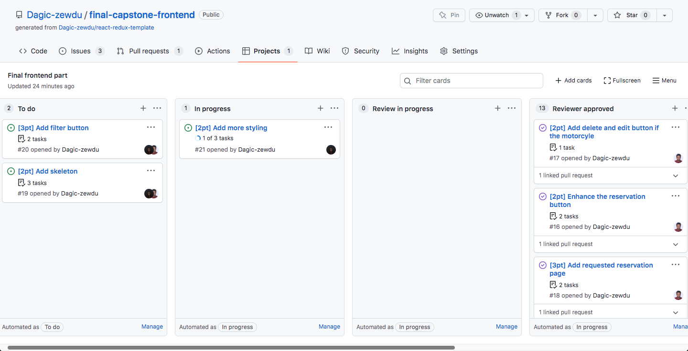

# Bcycom Front End


## Live Versions

- [Front-End](https://bcycom.herokuapp.com/)
- [Back-end](http://sleepy-forest-22507.herokuapp.com/)

## Link to the backend

- [Backend](https://github.com/oluyaratosin123/Final-Capstone-Back-End)

## Built With

- ReactJS
- Redux Toolkit
- Bootstrap
- CSS

## Getting Started

- Getting a local copy of this application is pretty much simple than you think. Just follow the steps below

### Install

- Node
- yarn
- git

### Local Copy

- Clone the project

```
git clone git@github.com:Dagic-zewdu/final-capstone-frontend.git
```

## Setup

### For the frontend

```
yarn install
```

Start server(frontend):

```
yarn run start
```

The front end app will open automatically to the default browser

## Kanban board

👉 [Kanban board link](https://github.com/orgs/UpliftLab/projects/3)

| Initial State | Final State |
| -------------- | -----------|
|  |  |

👉 This project was authored by <a href="#authors">two contributors</a> as described in the the Authors section bellow.

## Authors

👤 **Dagic Zewdu**

- GitHub: [@Dagic-zewdu](https://github.com/Dagic-zewdu)
- Twitter: [@dagic4](https://twitter.com/dagic4)
- LinkedIn: [LinkedIn](https://www.linkedin.com/in/dagic-zewdu/)

👤 **Edward Oluyara**

- GitHub: [@oluyaratosin123](https://github.com/oluyaratosin123)
- Twitter: [@TOluyara](https://twitter.com/TOluyara)
- LinkedIn: [LinkedIn](https://www.linkedin.com/in/edward-oluyara/)

## 🅰️ Acknowledgements

The design template is provided by
[Murat Korkmaz](https://www.behance.net/muratk)

## 🤝 Contributing

Contributions, issues, and feature requests are welcome!

## Show your support

Give a ⭐️ if you like this project!
